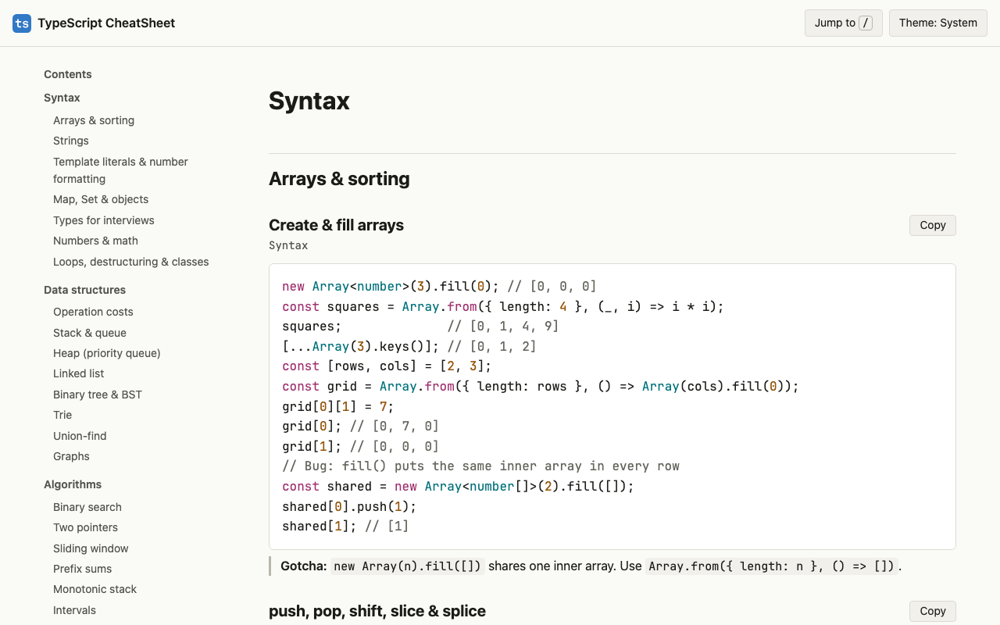
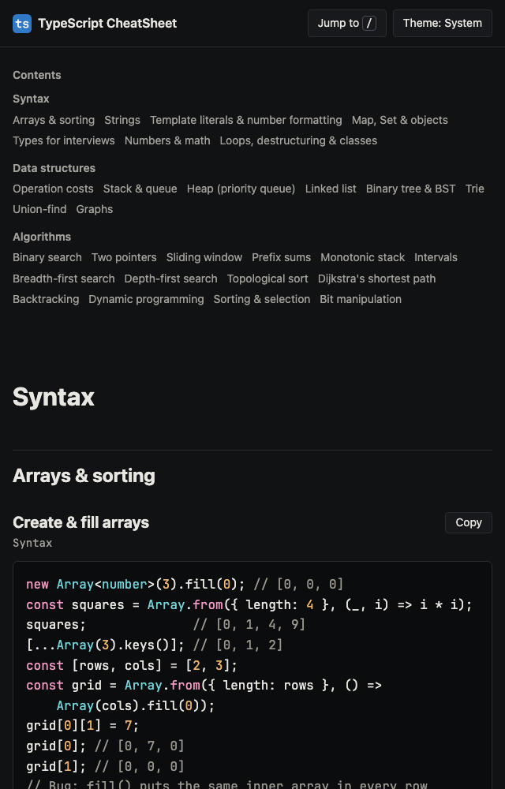
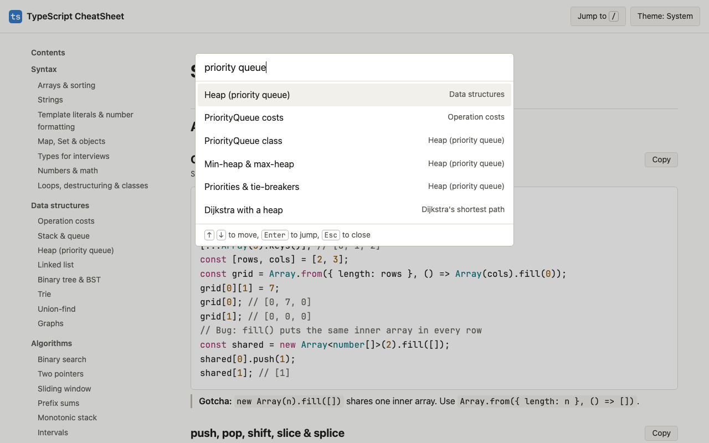

<div align="center">

# TypeScript CheatSheet 🔷

<kbd>
    
</kbd>

## Project Description 🎨

TypeScript CheatSheet is a single-page reference for TypeScript coding interviews: <https://arieltyson.github.io/typescript-cheatsheet/>. It covers the syntax that is easy to get wrong under pressure (sort comparators, `Map` and `Set`, dollars and cents with `Intl.NumberFormat`, integer division, `BigInt` and mod 1e9+7, the 32-bit bitwise limit), the data structures TypeScript does not ship (a generic heap and an O(1) queue), and tested templates for the common algorithm patterns, from binary search to Dijkstra. Every snippet is strictly typed, uses only built-ins, and runs under `node:test` before it can be deployed. All content is plain text on one page, so the browser's find (Cmd+F) always works. Pressing `/` opens a jump list. It is the sibling of [Python CheatSheet](https://github.com/arieltyson/python-cheatsheet) and shares its design.

## Screenshots:

<div style="display: flex; justify-content: center; align-items: center;">
    <kbd>
        
    </kbd>
    <kbd>
        
    </kbd>
    <kbd>
        
    </kbd>
</div>

## Technologies Used 💻

### Frameworks

- [x] **TypeScript (strict, ES2023 library)**: every snippet and the build itself, type-checked by TypeScript 7
- [x] **Node.js type stripping**: runs `.ts` files directly; no compile step, no bundler
- [x] **node:test**: 160 tests for snippets, the lexer, the build, colour contrast and the built page
- [x] **Prettier**: formatting at 72 columns

### APIs & Web Services

- [x] **GitHub Pages**: static hosting
- [x] **GitHub Actions**: format-check, type-check, test, build and deploy on every push

### Data Sources

- [x] **snippets/**: the tested TypeScript shown on the page
- [x] **content/site.ts**: a typed manifest of sections, titles, search aliases and complexity for all 109 entries
- [x] **web/tokens.ts**: every colour, as light and dark pairs

</div>

## Architecture 🏛️

- **Pattern**: Content as code. Tested `.ts` snippets and a typed manifest are compiled into one static HTML page by `tools/build.ts`
- **Lexer**: A small hand-written TypeScript lexer drives highlighting, extracts definitions by name, and finds imports for the guardrails
- **Results**: Demo snippets keep real `node:assert` calls so CI checks every documented result; the page shows them as `expression; // result`
- **Runtime dependencies**: None. Development only: `typescript`, `prettier`, `@types/node`
- **Quality Gates**: Prettier, `tsc --strict`, guardrails (imports, line and function length, no `any`, no `var`), WCAG contrast tests, a Content-Security-Policy and gzipped size budgets must all pass before deploy
- **Target**: Snippets type-check against ES2023; tooling needs Node.js 22.18+ (CI uses Node 24 LTS); evergreen browsers

## Features 🚀

- 🔎 **Cmd+F friendly**: every word on the page is plain text, nothing collapsed or hidden
- ⚡ **Jump list**: press `/` and type "priority queue", "money" or "course schedule"
- 🧰 **Syntax**: arrays and comparators, strings, number formatting, Map and Set, types, numbers and BigInt, classes
- 🧱 **Data structures**: a generic `PriorityQueue`, an O(1) `Queue`, linked list, tree, trie, union-find and graphs
- 🧭 **Algorithms**: binary search, two pointers, sliding window, BFS, DFS, topological sort, Dijkstra, backtracking, DP and more
- ⏱️ **Complexity on every snippet**: time and space stated in plain text
- 📋 **Copy buttons**: one click copies an entry's code
- 🌗 **Light and dark**: follows the system, with a manual toggle
- 🔒 **Private**: no cookies, analytics or third-party requests

## Running Locally 🛠️

```sh
npm ci
npm run build                     # writes dist/index.html
python3 -m http.server -d dist    # open http://localhost:8000
npm run check                     # format, type-check, test and build
```

To add an entry, write the function (or a `demo*` function with asserts) in `snippets/`, add tests in `tests/`, and add the entry to `content/site.ts`. The tests fail if an exported snippet is missing from the manifest, imports a package, or has a line over 72 characters.

## Privacy 🔏

TypeScript CheatSheet does not use cookies, analytics or trackers. The only thing it stores is your light or dark theme choice, in your own browser. The site is hosted by GitHub Pages, which may log visitor IP addresses under the [GitHub Privacy Statement](https://docs.github.com/en/site-policy/privacy-policies/github-general-privacy-statement).

<div align="center">

## Contributing ⚙️

Contributions are welcome. Fork the repository, create a branch, add the snippet, its tests and its manifest entry, run `npm run check`, then open a pull request that explains what the entry is for. New entries must use only built-ins and keep each function within 25 lines.

## License 🪪

This project is licensed under the MIT License. See `LICENSE` for details. JetBrains Mono is used under the SIL Open Font License 1.1 (`web/fonts/OFL.txt`).

</div>
